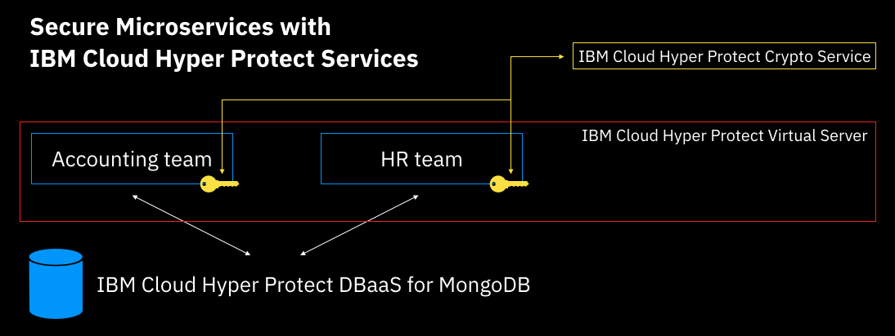

# Secured Microservices Writing to a Consolidated Database

A common pattern in microservice architectures, a single data layer, necessitates that teams or services with access to this  being able to read and write to it. If this data layer consists of a single database, you might want to restrict access on a per-team basis, by doing per-field encryption within the database. Then, only a given team with their own key, can read their data.

This Code Pattern is a node.js application that allows for the creation of keys, one for each "team" or "service. It uses that key to encrypt some customer data, ahead of being stored in the database. In this way, it demontrates the above example, while showing how to use the [Key Protect RESTful API][key-protect-api] provided by an instance of IBM Cloud Hyper Protect Crypto Services. IBM Cloud Hyper Protect DBaaS for MongoDB is used as the database as it provides a standard MongoDB managed service, encrypted to anyone outside of he organisation with legitimate access to it. The application runs in a Docker container, for example on a Mac or Linux laptop, or following the directions below, on IBM Cloud Hyper Protect Virtual Servers, for runtime protection in the public cloud.

When you have completed this code pattern, you will understand how to:

- Build and run a Docker container
- Get environment variables in a node.js app, from Docker
- Create an IBM Cloud IAM API key
- Drive the IBM Cloud Key Protect REST API, offered by IBM Cloud Hyper Protect Crypto Services


## Steps

The application joins together IBM Cloud Hyper Protect Crypto Services, and IBM Cloud Hyper Protect DBaaS for MongoDB. It can run anywhere, but runs well within an IBM Cloud Hyper Protect Virtual Server. So, let's provision those.


### Provision an instance of IBM Cloud Hyper Protect Crypto Services

1. Provision an instance of [IBM Cloud Hyper Protect Crypto Services][prov-hpcs] by following their documentation
2. Create a root key, and note its ID for later
3. Also note your Key Protect _instance ID_, and its _Key management (public) endpoint URL_.


### Provision an instance of IBM Cloud Hyper Protect DBaaS for MongoDB

1. Provision an instance of [IBM Cloud Hyper Protect DBaaS for MongoDB][prov-dbaas] by following their documentation
2. Note the database name (by default, `admin`), your cluster name, primary and secondary endpoints, and username and password


### Provision an instance of IBM Cloud Hyper Protect Virtual Servers

If you just want to run this application locally (in a Docker container) you don't need to do this step. But if you want a public cloud location to run it, that also protects the runtime and provides end to end security, you'll want to [provision an IBM Cloud Hyper Protect Virtual Server][prov-hpvs]. Follow the documentation to be able to SSH in to the server.

### Obtain an API Key

Clone or download this repo, and change into its directory.

You'l need an IBM Cloud IAM API key, so create one:

```bash
ibmcloud login
ibmcloud iam api-key-create securemicroservice
```

Note the value of the API key that it returns. This will be passed to the application, which in turn lets the application drive IBM Cloud APIs belonging to instances of services you own. (Ensure you log in as the same user that owns the Crypto Service instance.)


### Copy the Application Across to a Virtual Server

If you've created a Virtual Server and intend to run the application from there, you'll need to copy it across. To do this, you can use any regular Unix tooling like `rsync`, `scp`, etc., but the fastest way will be to download the zip file of this repository, and copy the whole (unextracted) zip across:

```bash
# Copy the zip file to the server
scp secured-microservices-writing-to-a-consolidated-database.zip root@_public-ip-of-your-virtual-server_

# SSH into the server
ssh root@_public-ip-of-your-virtual-server_

# Unzip and change into the code pattern directory
apt-get install -y unzip
unzip secured-microservices-writing-to-a-consolidated-database.zip
cd secured-microservices-writing-to-a-consolidated-database
```


### Run the Application

We're now in a position to run the application. While you can run it directly after installing node.js, it's easiest to use the provided _Dockerfile_. Install Docker, build an image, and then run a container after substituting in the parameter values.

```bash
# Install Docker
apt-get install -y docker.io

# Build the application
docker build -t secure-microservice .

# Run the application as a container
docker run -e IBM_API_KEY='Your key above' \
           -e IAM_PATH='https://iam.cloud.ibm.com/identity/token' \
           -e MONGO_USER='Your MongoDB username' \
           -e MONGO_PASS='Your MongoDB password' \
           -e ROOT_KEY_ID='The root key ID created for Crypto Service' \
           -e KP_URL='Your Crypto Service key protect endpoint URL' \
           -e KP_PATH='/api/v2/keys' \
           -e KP_INSTANCE='Your Crypto Service instance ID' \
           -e MONGO_ENDPOINTS='Your MongoDB primary and secondary endpoints (with ports), comma-separated' \
           -e MONGO_CLUSTER_NAME='Your MongoDB cluster name' \
           -e MONGO_DB_NAME='Your MongoDB database name' \
           -dp 3000:3000 secure-microservice
```

(Note: if you're using a Crypto Service instance in the IBM Staging Cloud, use a different endpoint, `https://iam.test.cloud.ibm.com/identity/token`.)

If you're running this on a server like an IBM Cloud Hyper Protect Virtual server with most ports closed using `iptables`, you'll need to open the port you're listening on. In this case, open port `3000`:

```bash
iptables -A INPUT -p tcp --dport 3000 -j ACCEPT
iptables-save > /etc/iptables/iptables.conf 
```

(The above commands, running as root.)


### Use the App

After running a Docker container, the app will now be listening on port 3000, so connect to it using a web browser at _IP address:3000_. Check that you see the sample output below.


### Storyline

Here's how to show this application working. Load the app, and then:

1. Click _Switch Team_.
2. Click the _Create team_ button to create a new (effectively, _accounting_) team, and associated key. This has driven the Key Protect REST API that Crypto Services provides.
3. Click _Enter Customer Details_.
4. Click _Generate Input_ to generate some random details. Perhaps add _(Accounting)_ to the end of the name field, to note which team you were effectively running as.
5. Click Submit. This information will now be encrypted using the generated key, and stored in MongoDB.
6. Click _View Customer Details_. You'll now see a field, pulled from your MongoDB instance. The entire database is encrypted for anybody that doesn't have legitimate access to it, but also encrypted at a field level, with the key stored in this application's runtime.
7. Click the row of the customer you just entered: the fields will be decrypted in the popup.
8. Now click _Home_: note that we'll effectively switch teams and keys, to act like another team writing to a consolidated database, by switching to the HR team.
9. Click _Switch Team_, then click the buttons _Delete team_, and _Create team_.
10. Click _Enter Customer Details_, and generate more random details. Append _(HR)_ to the end of the name to track, and then click _Submit_.
11. Click _View Customer Details_, and verify that you, as the HR team effectively, can see the data of the HR customer, by clicking their field in the table.
12. Now, close the popup and click the earlier-created field, the Accountng team customer. Note that now, the details are still encrypted such that you only see the ciphertext. You've now demonstrated that only a team member (or service) that holds the key for that team will be able to read the data owned by that team or service, such that you can consolidate data into one database, while now allowing everyone in the organisation to read it.


## Sample output

A website will be functional and served by the machine you're running
this code pattern on:




## License

This code pattern is licensed under the Apache License,
Version 2. Separate third-party code objects invoked within this code
pattern are licensed by their respective providers pursuant to their
own separate licenses. Contributions are subject to the [Developer
Certificate of Origin, Version 1.1](https://developercertificate.org/)
and the [Apache License, Version
2](https://www.apache.org/licenses/LICENSE-2.0.txt).

[Apache License
FAQ](https://www.apache.org/foundation/license-faq.html#WhatDoesItMEAN)


[key-protect-api]: https://cloud.ibm.com/apidocs/hs-crypto
[prov-hpcs]: https://cloud.ibm.com/docs/services/hs-crypto?topic=hs-crypto-get-started
[prov-dbaas]: https://cloud.ibm.com/docs/services/hyper-protect-dbaas-for-mongodb?topic=hyper-protect-dbaas-for-mongodb-gettingstarted
[prov-hpvs]: https://cloud.ibm.com/docs/services/hp-virtual-servers?topic=hp-virtual-servers-provision
